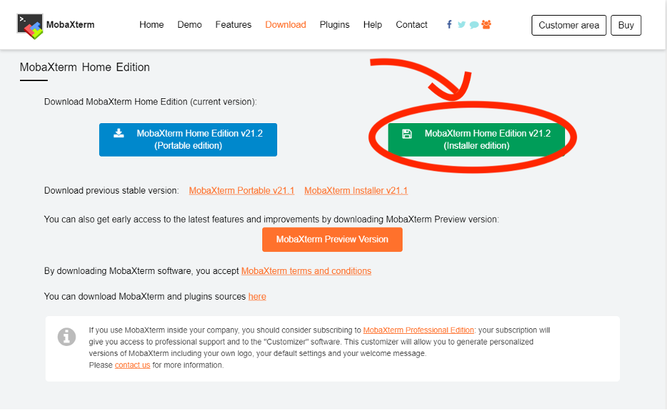
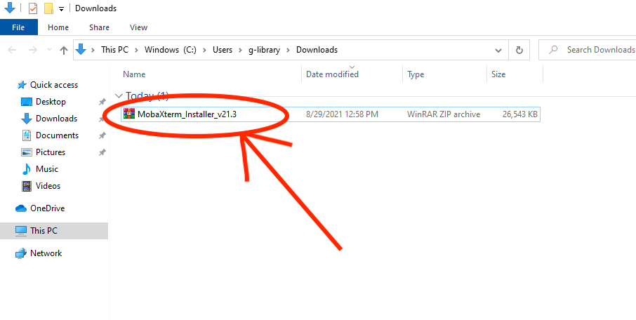
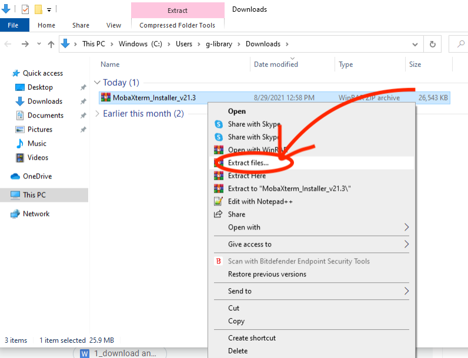
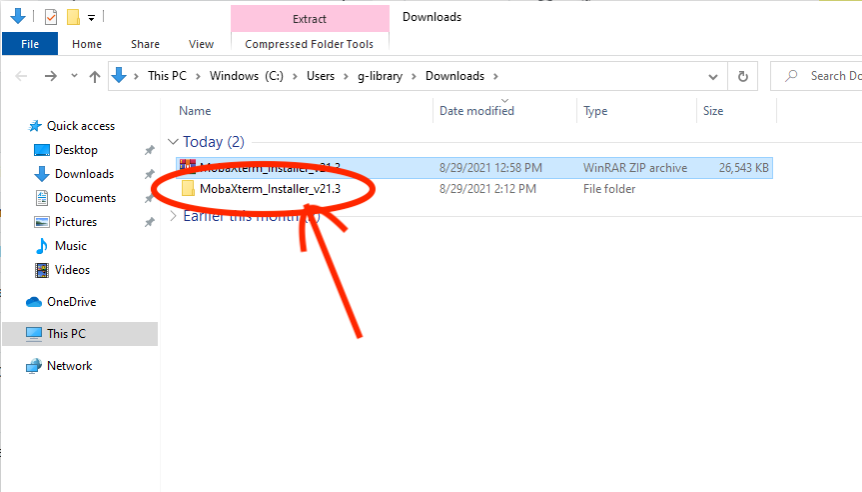
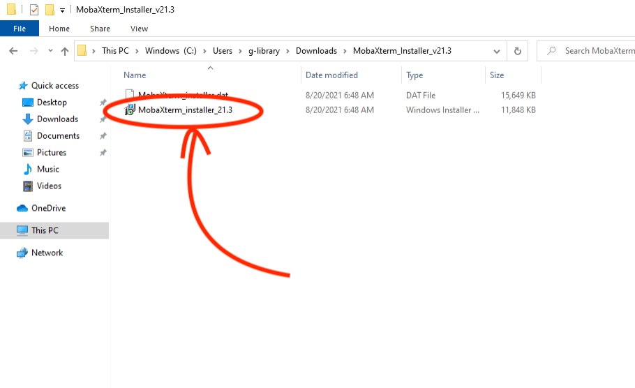
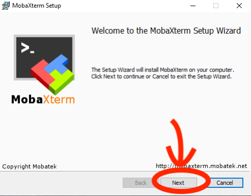
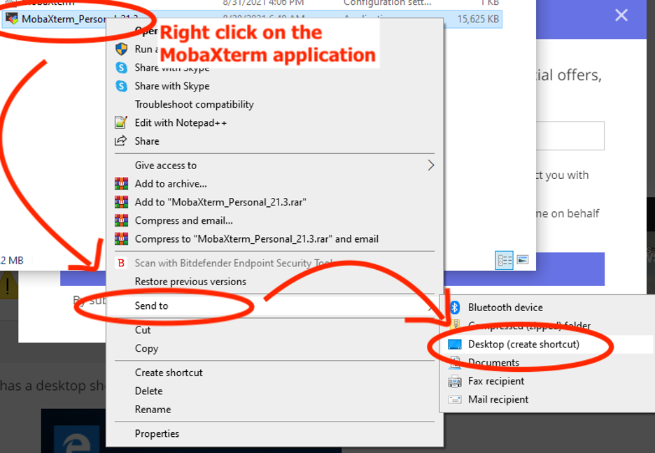

# How to: Install MobaXterm (Windows)

### Step 1: Make sure your computer is connected to the Internet.
If you are wireless on campus, be sure you are on the Fordham-S wireless network (not Fordham-P).  
  
  
### Step 2: Download MobaXterm:
Type the following URL to your browser:  
[http://mobaxterm.mobatek.net/download.html](http://mobaxterm.mobatek.net/download.html)
  
On the page (as below), click on the “Download now” button under the Home Edition (Free).  
  

  
Then on the following page (shown below), click on the green button displaying the latest version of “MobaXterm Home Edition...” to start downloading the installer file.  If the computer you are using is not your personal computer, the administrator privileges may be required to complete the installation.  
   

  
  
### Step 3:  
A zip file named “**MobaXterm_Installer_v21.3**” has been downloaded to your computer. (this name may be slightly different depending on the specified version you downloaded in the previous step).  
  

  
Right click on it and **extract** the files from it.  
  

  
Then, a window will appear with the extraction path and options.  You can change this information if preferred or just continue with the default settings.  After clicking the ok button to confirm, you should see a folder appear as shown below.  
  

  
When you open this folder, you should see two files as shown below.  Launch the installer by double clicking “**MobaXterm_installer_21.3**”.  
You may get a warning which states something similar to  “MobaXterm_installer_21.3” is a Windows executable, do you want to run it?”  If you get such a message, choose “Yes.”   
  

  
   
### Step 4:  
This will open the MobaXterm Setup Wizard. Click **next**.  
  

    
First, you will be given the User agreement. Check the box to accept and click **next**. In the following window, you are asked to confirm the destination folder for the installation.  The simplest way is to use the default path shown by the installer, but you could change this if you have a preferred location.  After pressing **next**, you will see the **install** button.  After clicking this button, the program will begin installing.  
  
  
   
   
### Step 5: Now you can run MobaXterm  
Congratulations, you have successfully downloaded and installed MobaXterm.  A clickable icon to open MobaXterm should have appeared on your computer.  _We can create a shortcut for this application in your desktop for this application, by_ **right-clicking** on the icon, click "**Send to**” and then select “**Desktop (create shortcut)**"   
  
  
   
You can see that I originally found the application through the “Downloads” folder where I completed the installation, but after making the shortcut it could more conveniently be opened right from the Desktop.  
From now on, you can use MobaXterm to log on to a remote server (such as storm.cis.fordham.edu).  Should you have any questions as you start learning the program, the MobaXterm website provides a useful and detailed [documentation](https://mobaxterm.mobatek.net/documentation.html#1) guide.   
  
  
