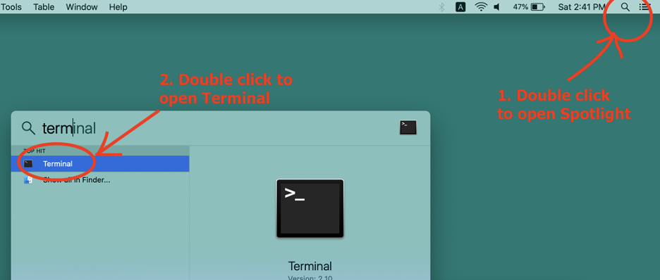

## How to: remote login from MAC  
  
#### Step 1:  
To complete this tutorial, an account should have been created for on the Fordham servers and you should have been given a username and password.  If you were not given these credentials, contact your instructor before proceeding to the next step.  My username “cking74” will be used throughout this tutorial along with the password “mypass” which you should remember to replace with your own information.   
  
It is also important to remember on which server your account exists in order to log in. There are two main servers for the department: **storm** located at the Rose Hill campus and **erdos** at the Lincoln Center campus. These are the machines that we will be remotely accessing.   
  
#### Step 2:  
Next, ensure that your computer is connected to the internet and launch Terminal. Terminal comes pre-installed on Mac computers. It can easily be located by clicking on Spotlight, typing “terminal” into the search bar and double clicking on the top result. 
  

