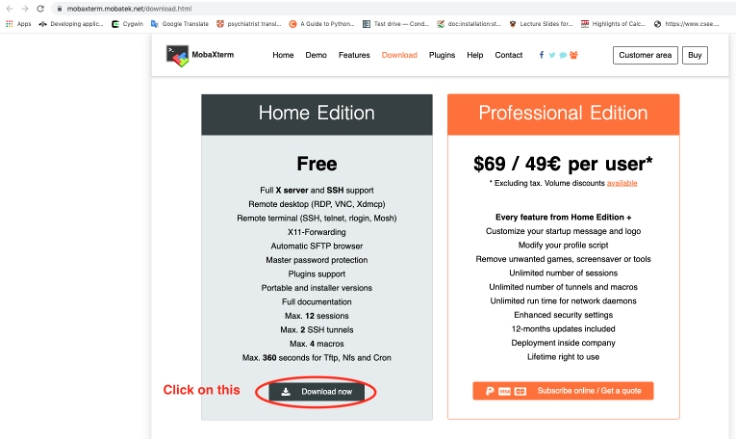

## How to: Install MobaXterm (Windows)

#### Step 1: Make sure your computer is connected to the Internet.
If you are wireless on campus, be sure you are on the Fordham-S wireless network (not Fordham-P).

#### Step 2: Download MobaXterm:
Type the following URL to your browser:  
[http://mobaxterm.mobatek.net/download.html](http://mobaxterm.mobatek.net/download.html)
  
On the page (as below), click on the “Download now” button under the Home Edition (Free).  

  
Then on the following page (shown below), click on the green button displaying the latest version of “MobaXterm Home Edition...” to start downloading the installer file.  If the computer you are using is not your personal computer, the administrator privileges may be required to complete the installation.  

#### Step 3:  
A zip file named “**MobaXterm_Installer_v21.3**” has been downloaded to your computer. (this name may be slightly different depending on the specified version you downloaded in the previous step) 

  
Right click on it and **extract** the files from it.  

  
Then, a window will appear with the extraction path and options.  You can change this information if preferred or just continue with the default settings.  After clicking the ok button to confirm, you should see a folder appear as shown below.  

  
